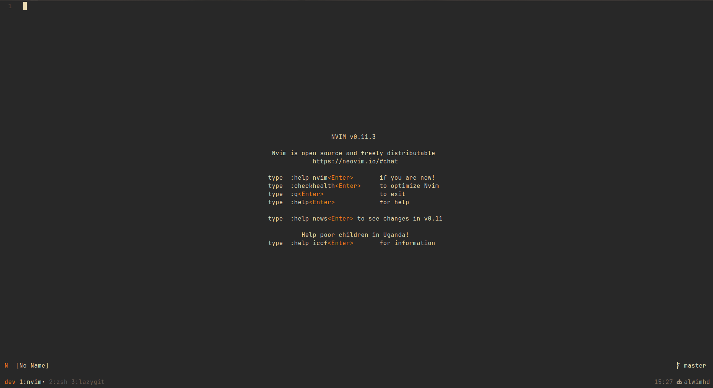

# Development environment setup

My personal development environment with Wezterm terminal emulator, Neovim text editor, Oh My Posh shell custom prompt and tmux

## Contents

- Wezterm config
- Neovim config
- Tmux config
- Oh My Posh config

## Wezterm config

### Requirements

- [Wezterm](https://wezterm.org/)
- [Nerd font](https://www.nerdfonts.com/) to display icons

## Neovim Config

### Requirements

- [Neovim](https://github.com/neovim/neovim) >= 0.10.0
- [Lazyvim](https://www.lazyvim.org/) Neovim plugin manager
- Git
- [Nerd font](https://www.nerdfonts.com/) to display icons
- [ Node js ](https://nodejs.org/)
- Ripgrep
